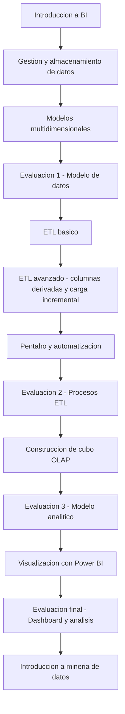

# Curso de Inteligencia de Negocios

Repositorio del curso **Inteligencia de Negocios**, centrado en el desarrollo de una solución de Business Intelligence utilizando datos abiertos del sistema educativo chileno.

Open Educational Resource (OER) for Business Intelligence courses.

## Estructura del repositorio

- **sesiones/**
  Presentaciones y materiales de cada sesión del curso.

- **proyecto/**
  Instrucciones, rúbrica y plantillas para el proyecto aplicado del curso.

- **COURSE_INFO.md**
  Información general del curso.

- **CITATION.cff**
  Metadatos para citar este repositorio académico.

## Flujo del curso
El curso sigue una progresión desde la gestión de datos hasta la visualización analítica y la introducción a técnicas de minería de datos. El siguiente diagrama resume el flujo de contenidos y evaluaciones del semestre.

El curso se organiza en torno un proyecto aplicado, cuyo objetivo es construir un sistema de análisis de matrícula escolar mediante técnicas de BI.

---

# Objetivo del curso

Comprender cómo las organizaciones utilizan datos para apoyar la toma de decisiones mediante procesos de:

- integración de datos
- modelamiento analítico
- construcción de indicadores
- visualización mediante dashboards

---

# Proyecto del curso

Durante el semestre los estudiantes desarrollarán un sistema BI basado en datos abiertos del Ministerio de Educación de Chile.

Producto final del curso:

**Dashboard analítico de matrícula escolar en Chile**

---

# Arquitectura del proyecto

Datos abiertos MINEDUC
↓
Exploración de datos
↓
Procesos ETL
↓
Modelo dimensional
↓
Dashboard BI
↓
Análisis para toma de decisiones

---

# Modelo dimensional

El modelo analítico se basa en un **esquema estrella**.

## Tabla de hechos

**Hecho_Matricula**

Medida principal:

- matrícula_total

## Dimensiones

- Dim_Tiempo
- Dim_Establecimiento
- Dim_Territorio
- Dim_Dependencia
- Dim_Nivel_Educativo

---

# Dashboard final esperado

El dashboard del proyecto incluye cuatro vistas analíticas:

1. Vista ejecutiva
2. Análisis territorial
3. Análisis institucional
4. Exploración por establecimiento

---

# Estructura del curso

El curso se desarrolla en **15 sesiones**.

| Unidad | Tema |
|------|------|
| U1 | Introducción a Business Intelligence |
| U2 | Analítica de negocios |
| U3 | Gobierno de datos |
| U4 | Gestión de proyectos BI |

---

# Entregables del proyecto

| Entregable | Contenido |
|---|---|
| 1 | Exploración de datos |
| 2 | Modelo dimensional |
| 3 | Implementación ETL |
| 4 | Dashboard final |

---

# Recursos del curso

- Presentaciones
- datasets
- guías de trabajo
- videos del canal de YouTube

---

# Autor

Julio López Núñez  
Ingeniero en Computación e Informática  
Doctor en Política y Gestión Educativa
